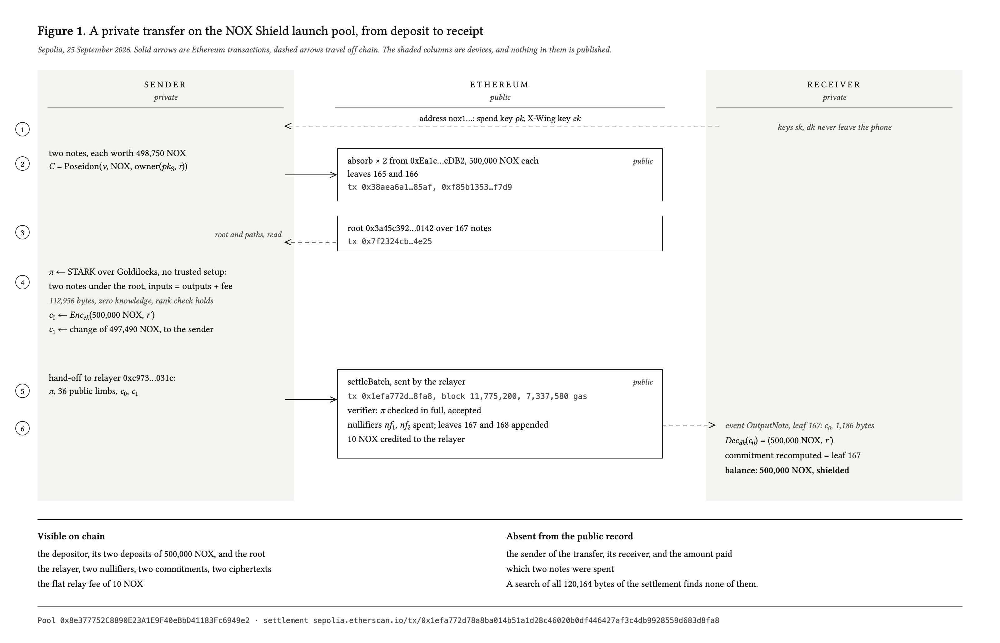
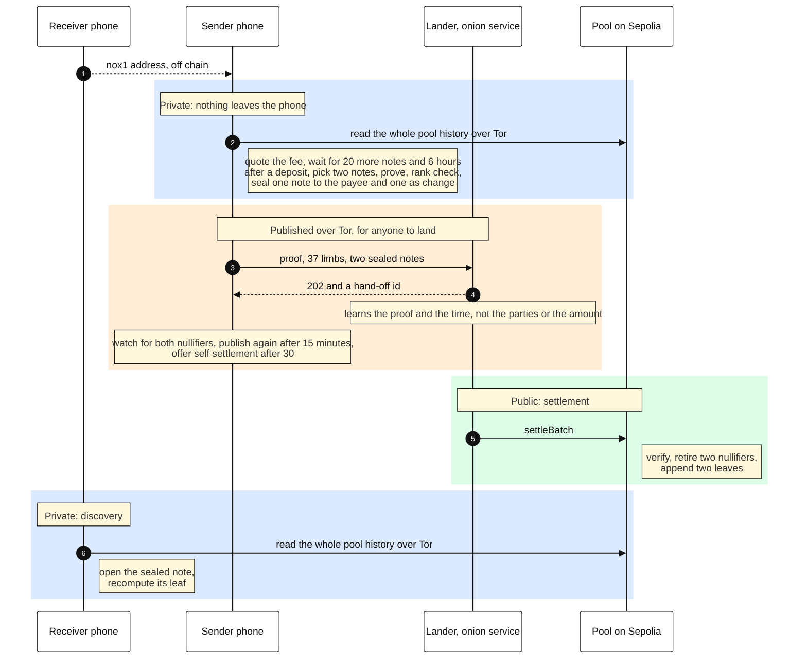
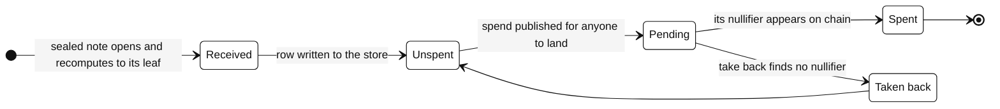
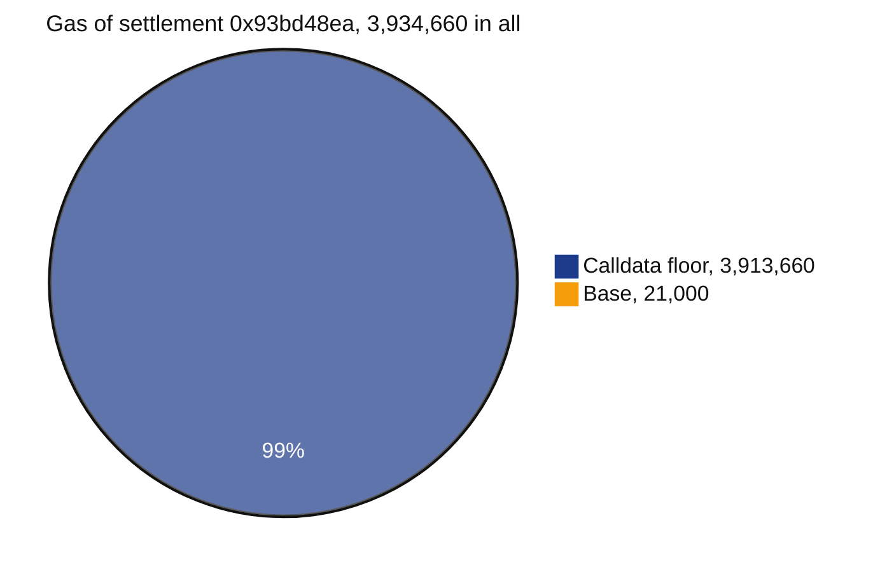

# NOX Shield wallet core

The Rust core of NØNOS Wallet, a phone wallet for NOX Shield: private transfers on Ethereum, proved on the phone and verified on chain.

> [!WARNING]
> The shield runs on Sepolia only, and its tokens have no value. Nothing here is audited: not the
> core, not the apps, not the pool. The proving time on a phone is not published. It needs the
> median of three runs whose proofs the live verifier accepts. The core times a pinned proof phase
> by phase with `profile_proof`, and the profile modes of the apps that run it are not built yet.
> Not done: publishing to the public Waku topic, whose specification is not in this repository yet,
> a spend published and landed through open settlement, a packet trace from a device, 24-hour fuzz
> runs on the build server, a Tamarin model of the hand-off, a formally verified ML-KEM. The full
> list is in [docs/20-security-status.md](docs/20-security-status.md).

| Fact | Value | Source |
|---|---|---|
| Pool | the NOX Shield production pool on Sepolia, `0xaEe51E82965Ec1DeD870F3f4c248Ad4AdDc3e1cb`, from block 11,817,433 | `core/src/net/pools.rs`, `ACTIVE` in `core/src/net/pool.rs` |
| Proof system | a STARK over the Goldilocks field with FRI (radix 8), 32-byte Merkle digests, hash-based, no trusted setup, blinded, with a zero-knowledge rank check on every proof | `vendor/stark_proofs`, `vendor/nox_prover` from the STARK repository at `e8f02a0`, tarball SHA-256 `dc147f96…0748`, built with `not_before` |
| Proof size | 94,760 to 95,752 bytes for the four pinned 37-limb vectors in shape A, each a 40-byte `NOXP` header (format 7) and the proof, proved byte for byte by this core and accepted by the production verifier. A lander takes 80,000 to 110,000 | `core/tests/prod_vectors.rs`, `verifyBatch` on the verifier, `core/src/wallet/relay_body.rs` |
| Proving time, server class | 67.7 s from the periodic cache and 82.7 s from nothing, on 4 virtual cores of an Intel Xeon at 2.10 GHz, peak 845 MB and 1,310 MB. FRI takes 56% | `core/tests/profile_prod.rs`, 1 October |
| Public inputs | 37 limbs in the file, 13 words on chain: the statement and a not-before time, the 600-second grid point just passed | `core/src/prover/launch/publics.rs`, `core/src/wallet/spend/not_before.rs` |
| Verifier cost | 3,934,660 gas for the first settlement on the production pool, the EIP-7623 floor of its 99,076 bytes of calldata | settlement [`0x93bd48ea…ec0d`](https://sepolia.etherscan.io/tx/0x93bd48eab8253ce497afbdc3fca7071a1d24a73599c866bd599101e301d2ec0d), block 11,817,581 |
| Amounts | standard sizes only, 1, 2 or 5 times a power of ten: 1,000 to 5,000,000 NOX, and 0.01 ETH to about 18.44 ETH | `AmountPolicy` on chain, `core/src/net/asset_v2.rs` |
| Fee | the protocol part, 0.0005 ETH or 400 NOX for a private transfer and 0.50% of a withdrawal, plus the lowest rung of the gas ladder. Read from the policy and checked by its `settlementFee` before any proving, never typed, and shown as a network fee and a protocol fee before the owner proves. A spend whose fee moved since is refused and quoted again | `core/src/net/fee_quote.rs`, `quote_spend` |
| Deposits | standard sizes, less 0.50% from `bps()` of the policy. A typed amount that is not one standard size becomes the fewest standard deposits under one review | `core/src/wallet/deposit_split.rs`, `review_shield_split` |
| Trust model | the verifier is fixed in the pool for its life. Whoever lands a spend cannot change the amount, the receiver or the fee. Keys never leave the phone | the pool contract, `core/src/wallet/relay_body.rs` |
| Networks | the shield on Sepolia. The public account on Ethereum mainnet and Sepolia | `core/src/net/pool.rs`, `core/src/evm/network.rs` |
| Open settlement | every proof pays `address(1)`, whoever submits its settlement, so anyone may land it. The wallet publishes a spend through Tor, never direct, to the first of five lander onions that answers, each checked for the pool and given 20 seconds, watches the chain for both nullifiers, publishes again after 15 minutes, and offers the owner to settle it after 30 | `core/src/wallet/publish`, `publish_spend`, `follow_spend`, `core/src/ffi/wallet/settle_self.rs` |
| Rewards link | a mainnet address that holds NOX names one testnet address in the registry `0xf1DC54d83b21D416ce619fA8C2E29C8381594225`, signed under EIP-712 by the mainnet side and sent by the testnet side, from the next weekly epoch | `core/src/wallet/rewards`, `rewards_link` |

One library serves the iOS app and the Android app, which hold presentation and platform
integration and decide nothing about money. The same recovery words also open an ordinary Ethereum
account that holds ETH, NOX and USDC on mainnet and on Sepolia.



Figure 1, also as [SVG](docs/figures/figure-transfer.svg) and [PDF](docs/figures/figure-transfer.pdf).
Every value in it is read from Sepolia. It was drawn on the launch pool. A transfer on the
production pool takes the same path, with a fee from the policy of the pool, a registered
association root, a wait after each deposit, a not-before time, and publication for anyone to land.

## How it fits together

The system, one colour per actor. Every arrow that leaves a phone goes through Tor.

```mermaid
%%{init: {"theme": "base", "flowchart": {"wrappingWidth": 360}, "themeVariables": {"fontFamily": "Arial, Helvetica, sans-serif", "fontSize": "15px", "primaryColor": "#ffffff", "primaryTextColor": "#111111", "primaryBorderColor": "#111111", "lineColor": "#111111", "secondaryColor": "#f5f5f5", "tertiaryColor": "#ffffff", "clusterBkg": "#fafafa", "clusterBorder": "#111111", "actorBkg": "#ffffff", "actorBorder": "#111111", "signalColor": "#111111", "noteBkgColor": "#fff8dc", "noteBorderColor": "#111111", "pie1": "#1e3a8a", "pie2": "#f59e0b", "pie3": "#14532d", "pieStrokeColor": "#111111", "pieOuterStrokeColor": "#111111", "pieSectionTextColor": "#ffffff", "pieTitleTextSize": "18px"}}}%%
flowchart LR
  subgraph S["Sender phone"]
    SK["recovery words and keys"] --> SC["wallet core: notes, prover, sealing"]
  end
  subgraph R["Receiver phone"]
    RC["wallet core: scan and trial decryption"]
  end
  T["Tor, embedded Arti"]
  RPC["public RPC servers"]
  X["lander onion service, or anyone who lands"]
  P["NOX Shield production pool on Sepolia"]
  V["STARK verifier"]
  G["association registry"]
  SC -- "proof and two sealed notes" --> T
  SC -- "pool history and account reads" --> T
  RC -- "pool history" --> T
  T --> X
  T --> RPC
  X -- "settleBatch, paid by the proof" --> P
  P -- "verify" --> V
  P -- "is the root registered" --> G
  RPC -- "events and state" --- P
  classDef phone fill:#dbeafe,stroke:#1e3a8a,color:#111111
  classDef tor fill:#ede9fe,stroke:#4c1d95,color:#111111
  classDef rpc fill:#f3f4f6,stroke:#374151,color:#111111
  classDef lander fill:#ffedd5,stroke:#9a3412,color:#111111
  classDef chain fill:#dcfce7,stroke:#14532d,color:#111111
  classDef private fill:#dbeafe,stroke:#1e3a8a,color:#111111
  classDef proof fill:#fef3c7,stroke:#92400e,color:#111111
  classDef public fill:#dcfce7,stroke:#14532d,color:#111111
  class SK,SC,RC phone
  class T tor
  class RPC rpc
  class X lander
  class P,V,G chain
```



The three layers of a private transfer: what stays on the phone, what the proof establishes, and
what the chain sees.

```mermaid
%%{init: {"theme": "base", "flowchart": {"wrappingWidth": 360}, "themeVariables": {"fontFamily": "Arial, Helvetica, sans-serif", "fontSize": "15px", "primaryColor": "#ffffff", "primaryTextColor": "#111111", "primaryBorderColor": "#111111", "lineColor": "#111111", "secondaryColor": "#f5f5f5", "tertiaryColor": "#ffffff", "clusterBkg": "#fafafa", "clusterBorder": "#111111", "actorBkg": "#ffffff", "actorBorder": "#111111", "signalColor": "#111111", "noteBkgColor": "#fff8dc", "noteBorderColor": "#111111", "pie1": "#1e3a8a", "pie2": "#f59e0b", "pie3": "#14532d", "pieStrokeColor": "#111111", "pieOuterStrokeColor": "#111111", "pieSectionTextColor": "#ffffff", "pieTitleTextSize": "18px"}}}%%
flowchart LR
  A["<b>Private, on the phone</b><br/><br/>recovery words, seed and keys<br/>note openings: value, asset, blinding<br/>which notes are spent, and to whom"]
  B["<b>What the proof establishes</b><br/><br/>the spent notes are leaves under a committed root<br/>inputs equal outputs plus the fee<br/>each nullifier belongs to its spent note"]
  C["<b>What the chain sees</b><br/><br/>two nullifiers and two commitments<br/>two sealed notes of 1,186 bytes each<br/>asset, fee, the submitter and a not-before time"]
  A -- "witness, never sent" --> B
  B -- "proof and 13 public words" --> C
  classDef phone fill:#dbeafe,stroke:#1e3a8a,color:#111111
  classDef tor fill:#ede9fe,stroke:#4c1d95,color:#111111
  classDef rpc fill:#f3f4f6,stroke:#374151,color:#111111
  classDef lander fill:#ffedd5,stroke:#9a3412,color:#111111
  classDef chain fill:#dcfce7,stroke:#14532d,color:#111111
  classDef private fill:#dbeafe,stroke:#1e3a8a,color:#111111
  classDef proof fill:#fef3c7,stroke:#92400e,color:#111111
  classDef public fill:#dcfce7,stroke:#14532d,color:#111111
  class A private
  class B proof
  class C public
```



A private transfer, and who learns what at each step.



The life of a note in the store (`core/src/store`). Take back returns a pending note whose
nullifier the chain does not hold, and the pool refuses the old hand-off if it settles later.



Where the gas of a settlement goes. Settlement
[`0x93bd48ea…ec0d`](https://sepolia.etherscan.io/tx/0x93bd48eab8253ce497afbdc3fca7071a1d24a73599c866bd599101e301d2ec0d),
the first on the production pool, fetched with `cast tx` and `cast receipt`: 3,934,660 gas used,
99,076 bytes of calldata of which 1,646 are zero. EIP-7623 charges at least 10 gas per calldata
token, a zero byte counting as one token and any other byte as four, on top of the 21,000 base.
That floor is 3,934,660, the gas used, so the calldata sets the price and execution costs less. A
settlement on the launch pool, [`0xbed088f0…d04f`](https://sepolia.etherscan.io/tx/0xbed088f0b842c8416a269d37bfb7342649d91a4260e1d6b73a7b3a51383ad04f), used 7,086,413.



The docs, one topic each:

| Doc | What it covers |
|---|---|
| [01-architecture.md](docs/01-architecture.md) | the modules, the boundary with the apps, a spend and a public send |
| [02-threat-model.md](docs/02-threat-model.md) | what each observer learns |
| [03-transport.md](docs/03-transport.md) | Tor, the servers, open settlement through the lander |
| [04-discovery.md](docs/04-discovery.md) | how the wallet finds its notes |
| [05-privacy-checklist.md](docs/05-privacy-checklist.md) | each privacy rule and the code that keeps it |
| [06-leak-ledger.md](docs/06-leak-ledger.md) | every leak, eliminated, bounded or open |
| [07-reproduce.md](docs/07-reproduce.md) | the pinned toolchain and a reproducible build |
| [08-fuzzing.md](docs/08-fuzzing.md) | the parsers under the fuzzer |
| [09-accounts.md](docs/09-accounts.md) | several accounts, view keys and key export |
| [20-security-status.md](docs/20-security-status.md) | what is checked and what is not |

## What works today

Only what has run. Each line names its evidence. What is not checked is in [docs/20-security-status.md](docs/20-security-status.md).

| What | Evidence |
|---|---|
| The production prover in this core proves the four pinned 37-limb vectors byte for byte, in format 5 and format 7 | `core/tests/prod_vectors.rs`, 1 October: 95,496, 94,760, 95,496 and 95,752 bytes, the four in 321.9 s at a peak of 1,372 MB |
| The production verifier accepts their single-call layout | `verifyBatch` on `0xDA9d…6A44` with `eth_call`, 1 October: `true` for all four |
| The production pool settles proofs of this format | [`0x93bd48ea…ec0d`](https://sepolia.etherscan.io/tx/0x93bd48eab8253ce497afbdc3fca7071a1d24a73599c866bd599101e301d2ec0d), block 11,817,581, through its lander |
| The fee a screen shows is the fee the policy takes, split into its two parts | `core/src/net/fee_schedule_test.rs`, and `settlementFee` on the policy, which split the four vector fees the same way on 1 October |
| A spend proves the fee it was quoted, or none | `core/src/ffi/wallet/quote_test.rs` |
| An amount splits into the fewest standard deposits, and each is one the policy takes | `core/src/wallet/deposit_split_test.rs`, every cent to 100 ETH, and `depositFee` on the policy |
| A rewards link is signed and encoded as the registry expects | `core/src/wallet/rewards/rewards_test.rs`: the digest equals `linkDigest` of the registry, the signature equals `cast wallet sign`, the call equals `cast calldata`, and `link` simulated from the testnet address did not revert |
| A published spend is followed to its landing, published again after 15 minutes, and offered to its owner after 30 | `core/src/wallet/publish/publish_test.rs` |
| A spend anchors only to a root the association registry holds | `core/src/wallet/registry.rs`, which the wallet checks before it proves |
| A spend waits for 20 more notes and 6 hours after its newest input, unless the owner types EARLY | `core/src/wallet/spend/ripe_test.rs` |
| Each withdrawal is offered an unused address of the same words | `core/tests/withdraw_to.rs` |
| On the launch pool, the live verifier accepts proofs from the launch prover | the `launch-proof` job, from commit `c211a24` on: a 112,956-byte proof file, then `ci/verify-kit/verify.sh`, which prints `accepted` |
| On the launch pool, the proof the wallet writes is the proof a settlement carries | the file is a 40-byte `NOXP` header and the proof. The kit, like the relayer, re-encodes the proof into the verifier one-call layout, which is the 113,216-byte `proof` argument of `settleBatch` in settlement `0xbed088f0…d04f` |
| On the launch pool, a private transfer settled and reached a phone | settlement [`0x1efa772d…8fa8`](https://sepolia.etherscan.io/tx/0x1efa772d78a8ba014b51a1d28c46020b0df446427af3c4db9928559d683d8fa8), block 11,775,200, 7,337,580 gas, leaf 167 |
| The settlement reveals no sender, receiver or amount | Figure 1, and a search of the 120,164 bytes it put on chain: 116,708 of calldata, 2,752 of event data and 704 of topics |
| The per-proof zero-knowledge check holds in general position and refuses the collision class | `zk_rank_test` in `vendor/stark_proofs`, run by the `launch-proof` job |
| The 0x account matches the standard derivation of the same words | `core/src/evm/account_test.rs`: the BIP-39 test phrase gives `0x9858EfFD232B4033E47d90003D41EC34EcaEda94` |
| EIP-1559 signing is exact | `core/src/evm/tx_test.rs`: two signed transactions, one per network, equal to `cast mktx` byte for byte |
| Swap and approval calls are exact | `core/src/evm/swap/calldata_test.rs`: three router calls and one approval equal to `cast calldata` byte for byte |
| Swaps are quoted and simulated against mainnet | `core/tests/account_live.rs`, run over Tor as a real holder: 0.01 ETH quoted at 8,229.8 NOX and 26.77 USDC, both simulated as the sender, and a NOX sale asked first for an approval of its amount |
| Every RPC the wallet lists answers over Tor | `core/src/evm/rpc.rs`, test `every_listed_rpc_answers_over_tor_for_its_own_chain` |
| The lander answers over its onion service and takes a fee paid to whoever submits | `core/src/net/relay/mod.rs`, test `the_lander_answers_over_tor_and_takes_the_submitter_fee` |
| No nonce is used twice and the account is never left stuck | `spec/Account.tla`, 1,102,290 states, CI job `tla` |
| Two devices on one phrase never pay a note out twice, and a lost hand-off never freezes one | `spec/Notes.tla`, 243,473 states, and `spec/Frozen.cfg` must still fail, showing the hole take-back closes |
| Fee offers, gas limits, RLP, the NOX fee split, revert decoding and the balance check hold for every input | Kani 0.68.0, 7 harnesses verified in 2 min 29 s on 1 October. The `kani` job of the `check` workflow runs them once the core workflows, disabled by hand since 26 September, are enabled again |
| Amount arithmetic, transfer balance, the address alphabet and the fee, offer, nonce and cover of a public send are proved on the Rust that ships | `lean-verified/`, 20 theorems, Charon and Aeneas, CI workflow `verify` |

## How to verify it

The four pinned 37-limb vectors, from `spec/wallet-vectors-not-before/` of the STARK repository,
proved byte for byte, with their single-call layout and 13 words written out for the verifier:

```sh
PROD_VECTORS=path/to/wallet-vectors-not-before PROD_VECTORS_OUT=/tmp/out \
    cargo test --release -p nox_shield_core --test prod_vectors -- --ignored --nocapture
```

Where a proof spends its time, phase by phase. The first run proves from nothing and keeps the
periodic cache, the second proves from it:

```sh
PROD_VECTORS=path/to/wallet-vectors-not-before PROD_CACHE=/tmp/periodic.bin \
    cargo test --release -p nox_shield_core --test profile_prod -- --ignored --nocapture
```

The verification kit in `ci/verify-kit`, tarball SHA-256
`c63e192304bee55880bdced6ea13169c8d89c9e8192aa46562a587660ee2cbc4`, checks a launch proof against
the launch verifier. It is kept for the launch pool, where notes stay spendable, and needs Foundry
and a Sepolia RPC. A kit for the production verifier is not written: its check is `verifyBatch`
with the files `prod_vectors` writes, read with `eth_call`.

```sh
export RPC=https://ethereum-sepolia-rpc.publicnode.com

# The kit checks its own files, and that it tells a route 2 proof from an older one.
ci/verify-kit/selftest.sh

# Prove a transfer at the launch point with this checkout, then ask the live verifier.
NOX_PROOF_OUT=/tmp/proof cargo test --release -p nox_shield_core --test proof \
    -- --ignored a_transfer_proves --nocapture
ci/verify-kit/verify.sh /tmp/proof/export/launch-proof.bin \
    /tmp/proof/export/launch-proof.publics.json
```

The rest of the claims above:

```sh
cargo test --workspace --all-features            # every unit and integration test
cargo test --release -p stark_proofs zk_rank_test # the zero-knowledge rank check
spec/check.sh                                     # the TLA+ models, with Java 17
cargo kani -p nox_shield_core --lib --harness <name> # each model checker harness
(cd lean && lake build)                           # proofs about models
nix build .#checks.x86_64-linux.extraction        # the Lean matches what the Rust produces
(cd lean-verified && lake build)                  # proofs about verified/src itself
cargo deny check && cargo audit                   # the dependency gate
for s in scripts/check-*.sh; do "$s"; done        # the privacy gates
scripts/reproduce.sh android                      # two builds of the phone libraries, compared
```

The tests that need the network are marked `#[ignore]` and run with `--ignored`. They read
public chain state over Tor and sign nothing.

## How to build it

| Tool | Version | Where it is pinned |
|---|---|---|
| Rust | 1.91.1 | `rust-toolchain.toml` |
| Lean | 4.31.0 | `lean/lean-toolchain` |
| Charon and Aeneas | Aeneas `45061fa`, with its Charon | `flake.nix`, `flake.lock` |
| TLA+ tools | 1.8.0, SHA-256 `32d64fbb…acf81` | `spec/check.sh` |
| Foundry | the current release | the verification kit |
| Kani | 0.68.0 | the `kani` job of `.github/workflows/check.yml` |
| Android NDK | 27.0.12077973, which Google ships as r27, with `cargo-ndk` 4.1.2 | `.github/workflows/reproduce.yml`, and the flake of the Android app |

Times from one run of the jobs on commit `591a8ac`, on GitHub `ubuntu-latest` runners, before
builds moved to the build server:

| Job | What it runs | Time |
|---|---|---|
| `rust` | fmt, clippy with `-D warnings`, every test | 448 s |
| `launch-proof` | the rank check, a launch proof (291.1 s of it), the kit and the live verifier | 1,561 s |
| `tla` | three TLA+ models | 93 s |
| `lean` | the model proofs | 23 s |

The phone libraries and the apps are built by CI in their own repositories, from the core
commit their `core.lock` names. `scripts/reproduce.sh` builds the same libraries here twice from
clean, in two directories, and compares their bytes, and the `reproduce` workflow runs it for
Android on Linux and for iOS on macOS. The hashes are in [docs/07-reproduce.md](docs/07-reproduce.md).
`vendor/` holds the prover source at a pinned commit, and `vendor/README.md` records where each
crate came from and its SHA-256.

## Limits

- The shield runs on Sepolia only, until an external audit and a hardening redeploy.
- Nothing here has been audited.
- ETH is held to about 18.44 ETH per amount. The pool allows 50 ETH, and a note holds at most
  p - 2 wei.
- The proving time on a phone is not published. The rule is a median of three runs, each proof
  accepted by the live verifier, with the device, the build and the thermal state. One run is timed and not verified. `profile_proof` times the pinned `transfer-eth` vector phase by phase and checks its proof byte for byte, and the profile modes of the apps that run it on a phone are not built yet.
- Swaps run on Ethereum mainnet only, on Uniswap V2, through the NOX/WETH and USDC/WETH pairs.
  Sepolia has no NOX pool.
- USDC is held in the public account only. The pool has not registered it.
- Notes on the launch pool and the v2 pool stay there. Moving them to the production pool is a
  public withdrawal to a fresh address and a new deposit. The app does not do it yet.
- Open settlement publishes through the lander onion only. The public Waku topic is not wired,
  because its publish specification is not in this repository yet.
- No spend made by the app has been published and landed through open settlement yet. The first
  settlement on the production pool went through its lander before open settlement was written.
- A spend waits for 20 more notes and 6 hours after the deposit it spends. Typing EARLY skips the
  wait, and the review says it can be linked by timing.
- A Tamarin model of note sealing and the hand-off, and a formally verified ML-KEM, are not
  started.
- No packet trace from a device is taken, so the network claims are claims about the code.
- No 24-hour fuzz run on the build server is recorded. What ran is in
  [docs/08-fuzzing.md](docs/08-fuzzing.md).
- The iOS archives have not yet been built twice and compared. The Android libraries have, in
  [docs/07-reproduce.md](docs/07-reproduce.md).
- A view key cannot be revoked. The only way to stop one is to move the value to a new account.
- A wallet whose vault was written before version 2 cannot show its words again.

## Security and privacy

**Keys.** The recovery words give a 64-byte seed. It is sealed on the device under a key the
Secure Enclave (iOS) or StrongBox (Android) holds, which opens only when the owner is present.
From the seed come two separate families of keys, and neither can be derived from the other:
the public account at `m/44'/60'/0'/0/i` through BIP-32, and the shield keys through BLAKE3 in
derive-key mode under their own contexts, for each account i. Keys exist in memory only while the
wallet is unlocked. A key or the words leave the device only when the owner exports them after
the keystore confirms it is them, and the spend secret alone never does
([docs/09-accounts.md](docs/09-accounts.md)).

**Network.** The rules and the server list are in [docs/03-transport.md](docs/03-transport.md).
Every connection goes through Tor, embedded in the core (Arti), with TLS end to end. Each purpose
has its own circuits: the pool scan, the publication of a spend, deposits, the mainnet account and
the Sepolia account, and each account has its own. A failed Tor connection is reported, and there
is no direct connection to fall back to. A stalled connection gives up after 30 s.

**What the wallet contacts.** The Tor network. Public RPCs:
`ethereum-rpc.publicnode.com`, `1.rpc.thirdweb.com`, `eth.rpc.blxrbdn.com` and
`eth-mainnet.public.blastapi.io` on mainnet, and `ethereum-sepolia-rpc.publicnode.com`,
`rpc.sepolia.ethpandaops.io` and `sepolia.rpc.thirdweb.com` on Sepolia. On mainnet, signed
transactions go to the private relays `rpc.flashbots.net` and then `rpc.mevblocker.io`, which
keep them out of the public mempool until they are mined. A spend goes to the lander onion
service, and the rewards registry and the fee policy are read through the Sepolia RPCs above.

**What the wallet never sends.** Analytics, crash reports, device identifiers, the recovery
words, any key, or a request that names a note. The pool scan reads every event of the pool, so
every wallet sends the same requests.

**Before anything is signed.** A send, a swap, a deposit, a rewards link or a self settlement is
worked out in full by the core first: the
balance, the nonce, the fees, a simulation as the sender, and for NOX the token state read from
two servers that must agree. The review is held for 90 s and bound to the account it was made
for. Every batch starts with `eth_chainId`, and the chain id is checked again just before
signing. The tip is capped at 5 gwei and the fee at 1,000 gwei. A swap allows at most 5%
slippage and is refused above 15% price impact.

**Addresses.** Each one below was read from the chain before it was written here.

| What | Network | Address |
|---|---|---|
| NOX Shield production pool | Sepolia | `0xaEe51E82965Ec1DeD870F3f4c248Ad4AdDc3e1cb` |
| Production fee policy | Sepolia | `0x660f66ab31Ca9919D9e1770FEDc88Ff2dd29CE59` |
| Production verifier | Sepolia | `0xDA9dD4A3e957AFD2179131273C93dabBA1186A44` |
| Production lander 1 | Tor | `mforujillfk4w5h2zqgxdzendn3qb2zes4r2h57ownojshhmtcdzgdyd.onion` |
| Production lander 2 | Tor | `lfpw5uoslfiqmwsc7o2d2qts3grmfnixrhae3hkgkv6x4dlxpvafp4yd.onion` |
| Production lander 3 | Tor | `7ywwruseitmycfjwh2upbecetm6edej7pkxpp4xtzmtioes4ubs63kad.onion` |
| Production lander 4 | Tor | `g7uyxmffgim7sneprrkdp4ecshupvd3kuaadho6f7e2gcd3gazimriyd.onion` |
| Production lander 5 | Tor | `ewjq3ue43pclh6qyx3triup7org64nykbjgy7tmderlzzx27kstfdiqd.onion` |
| Rewards link registry, epoch 0 from 1 October 2026 | Sepolia | `0xf1DC54d83b21D416ce619fA8C2E29C8381594225` |
| Guardian of the production policy, which may pause | Sepolia | `0x6B02855b93f946643cbE1b499308645B59423188` |
| NOX Shield v2 pool, before production | Sepolia | `0xD0dBCe195c082DA39a218C62c01a732CE5b4d541` |
| `AmountPolicy` of the v2 pool: sizes, flat fees, pause | Sepolia | `0xF4a8e6e39e08A93c635a1Db8be4ECf1f6541444e` |
| v2 verifier, fixed in the pool | Sepolia | `0xde6110142b39730f480f9d66C408F150A7e823C1` |
| Association registry | Sepolia | `0xF6B5c3470eb7F1bdE3412E72Eff4235A4536a206` |
| Safe, owner of the pool | Sepolia | `0xD4251BA8bD4F68690BaB9f27d544819cFBE11854` |
| NOX Shield launch pool, deposits paused | Sepolia | `0x8e377752C8890E23A1E9F40eBbD41183Fc6949e2` |
| NOX | Ethereum | `0x0a26c80Be4E060e688d7C23aDdB92cBb5D2C9eCA` |
| NOX | Sepolia | `0x3E5249A65CA513D5e11260222e0D26f46b465d36` |
| USDC | Ethereum | `0xA0b86991c6218b36c1d19D4a2e9Eb0cE3606eB48` |
| USDC | Sepolia | `0x1c7D4B196Cb0C7B01d743Fbc6116a902379C7238` |
| Uniswap V2 router | Ethereum | `0x7a250d5630B4cF539739dF2C5dAcb4c659F2488D` |
| NOX/WETH pair | Ethereum | `0x07CE5889D2EB681Af3bD61db24Ab2602c502Bd1B` |
| USDC/WETH pair | Ethereum | `0xB4e16d0168e52d35CaCD2c6185b44281Ec28C9Dc` |

**Transactions.** Each one below was read from the chain.

| What | Block | Transaction |
|---|---|---|
| The first settlement on the production pool, through its lander | 11,817,581 | [`0x93bd48ea…ec0d`](https://sepolia.etherscan.io/tx/0x93bd48eab8253ce497afbdc3fca7071a1d24a73599c866bd599101e301d2ec0d) |
| The v2 pool deployed | 11,786,932 | [`0xcabd57e8…75d0`](https://sepolia.etherscan.io/tx/0xcabd57e8b35b8b8e159edc884994cda125178d9b3811aa450c697d11bea275d0) |
| The v2 verifier attested with a proof | 11,786,928 | [`0x9832e530…e3`](https://sepolia.etherscan.io/tx/0x9832e530948db1646544a32b7a99d001bf41e5b44f6f381191d7798879e77ae3) |
| Beta mode on v2 ended | 11,786,937 | [`0x547ffbab…b037`](https://sepolia.etherscan.io/tx/0x547ffbab0fc0afbf75b8153ebddd4c75b67f42ceeb3080600ee4344354ffb037) |
| The Safe took ownership of the v2 pool | 11,786,946 | [`0x23497c2c…1fd3`](https://sepolia.etherscan.io/tx/0x23497c2c0ad899a2d436365093a9b8aaa24b5c6e094c1fa823ff2467fa451fd3) |
| Deposits into the launch pool paused | 11,785,998 | [`0x9d9f8299…4141`](https://sepolia.etherscan.io/tx/0x9d9f82997e387f237069f763a95f2902e7f89a487952781aacdc8f7f766c4141) |
| The first settlement on v2 | 11,787,245 | [`0x3244a854…6e5e`](https://sepolia.etherscan.io/tx/0x3244a8540f897891b4186cd62cc3836f664404b85612f1a9244ec4024e4f6e5e) |

**Reporting a flaw.** Write to ek@nonos.systems or team@nonos.systems, and allow 90 days before publishing.

## Questions

**Is it private today?** On Sepolia, a transfer shows no sender, receiver or amount on chain.
Timing is visible: a deposit followed soon by a transfer can be linked by an observer. The wallet
waits for 20 more notes in the pool and 6 hours after a deposit before it spends it, and a
withdrawal goes to an address of the wallet never used before. The more people use the pool, the
weaker the link.

**Can it hold real money?** Not in the shield, which runs only on Sepolia. The public 0x account
holds and sends ETH, NOX and USDC on Ethereum mainnet with real funds, and swaps them there.
The wallet has not been audited.

**Has it been audited?** No.

**Who controls the pool?** A Safe multisig, `0xD4251BA8…1854`, owns the production pool and its
policy, as `owner()` read on 1 October. It can pause deposits, register assets, approve swap
routers, and change the fee router after a timelock. Through the policy it can change the sizes,
the fee schedules and the two percentages, at most 1%, each 48 hours after announcing them, and it
or the guardian can pause deposits and settlements for 7 days, at most once a week. After a delay
it can also
appoint a priority settler, which gets the first turn for a window after each settlement. A daily
open slot stays for everyone, so a settler can delay others but never shut them out. It cannot move a note, change its owner, or replace the proof verifier, which is fixed in the pool
for its whole life. These are properties of the pool
contract, which lives in its own repository.

**Is the pool still in beta?** No. `betaMode()` reads `false` on the production pool. Beta mode on
v2 ended in
[`0x547ffbab…b037`](https://sepolia.etherscan.io/tx/0x547ffbab0fc0afbf75b8153ebddd4c75b67f42ceeb3080600ee4344354ffb037),
block 11,786,937, and on the launch pool in
[`0xcbd9542e…c9d5`](https://sepolia.etherscan.io/tx/0xcbd9542ec16f00ce7b1e3777066e7f62716ab77d2299619a240b553deb29c9d5),
block 11,775,568. `betaMode()` reads `false` on both. No refund and no wind-down can
happen, so no depositor can close the pool on the people who received transfers.

**Can anyone else see my balance or stop my transfer?** The keys never leave the phone, so no one
else can read the notes or spend them. A spend is published for anyone to land, since its fee
pays whoever submits it. A lander can refuse or delay. The wallet then publishes it again after 15
minutes, and after 30 offers the owner to settle it from the public account, which is weaker for
privacy. No one who lands a spend can change the amount, the receiver or the fee.

**What if nobody lands my transfer?** The notes it would spend are held as in flight. Take back
reads the whole history of the pool and returns every one the chain shows unspent. If the old
hand-off is settled later after all, the pool refuses whichever proof comes second.

**What does a lander learn?** The proof, the sealed notes and the time it received them, which the
chain shows anyway once the spend settles. Over Tor it does not learn the IP address of the sender.

**What is the rewards link?** The testnet rewards count NOX held or locked on mainnet for the
testnet address it is linked to. The mainnet address signs the link, the testnet address sends it,
and it counts from the next weekly epoch. The link is public: it ties the two addresses together.

**What if the phone is lost?** Restore from the recovery words. The wallet finds its notes again by
reading the chain.

**Can my NOX be frozen?** The NOX token contract has a blacklist controlled by its governance
multisig, and it has not been renounced. A blacklisted address cannot send NOX, and that
includes the pool itself if it were ever blacklisted. USDC has a blacklist controlled by Circle.

**What does it cost?** 0.50% when depositing into the shield. A private transfer pays 0.0005 ETH or
400 NOX, and a withdrawal 0.50% of its amount, plus the lowest rung of the gas ladder, 0.0025
ETH or 2,000 NOX. The screen shows the two parts
before anything is proved. A public send pays Ethereum gas, and on mainnet the NOX token fee of 3%
on sales into its pair. A swap also pays the 0.3% fee of each Uniswap pair it passes through.

**How are swaps done?** From the public account, never from the shield, on Uniswap V2 on
Ethereum mainnet. The core reads both pools from two servers, quotes with the NOX fees and the
fee sale the NOX token can make inside a sale, sets the least that must arrive, and simulates the
swap as the sender before anything is signed. A token going in is approved for the amount swapped and no more. The pool contract has a swap path of its own that has never been used, and the wallet
does not use it.

**Is it post-quantum?** Notes are encrypted with a hybrid of ML-KEM-768 and X25519, so a note
stays sealed while either holds. The proofs are hash-based, and on the production pool the Merkle
digests are 32 bytes.

**How fast does a phone prove?** It is being measured. The number is published only after the
proof from that run has been accepted by the live verifier.

**Is it legal to use?** It depends on where you live. Privacy software has been sanctioned in
some jurisdictions before. This is not legal advice.

## Legal

This software is licensed under AGPL-3.0-or-later and comes with no warranty. The shield runs on
a test network and holds no value. Nothing in this repository is financial or investment advice,
or an offer of any token. Users are responsible for complying with the law where they live,
sanctions included. The full text, with the privacy policy and the third-party licences, is in
[LEGAL.md](LEGAL.md), and both are to be reviewed by a lawyer before any public release.

## Licence

AGPL-3.0-or-later.
